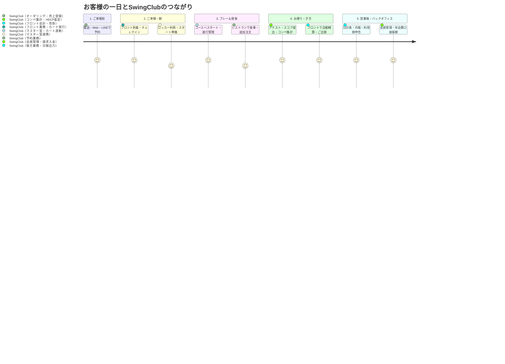
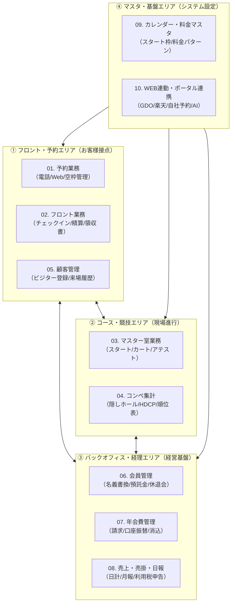

# 【はじめに】SwingClub-CLOUD 全体鳥瞰図とゴルフ場業務マップ

> **対象**: 津カントリー倶楽部 全スタッフ（フロント・マスター室・レストラン・総務経理・支配人）、新任スタッフ、社内AI
> **システム提供元**: [東京システムハウス株式会社（TSH）SwingClub-CLOUD](https://www.tsh-world.co.jp/swing/)
> **作成日**: 2026-08-17
> **位置づけ**: 利用者目線マニュアルの「全体像・アイスブレイク・鳥瞰図」

---

## 1. そもそも「SwingClub」とは？（30秒アイスブレイク）

ゴルフ場に来場されるお客様の一日は、**「予約する ➔ クラブハウスに到着・チェックイン ➔ コースへ出てプレー ➔ レストランで食事 ➔ お風呂に入って精算・ご出発」** という一本のストーリーで流れています。

このすべての瞬間を裏側で支え、データをつないでいる心臓部が、東京システムハウス（TSH）のゴルフ場基幹システム **『SwingClub-CLOUD（スイングクラブ・クラウド）』** です。

全国200コース以上の名門・パブリックゴルフ場で導入されており、津カントリー倶楽部でも2026年に最新のクラウド版への移行を進めています。

---

## 2. なぜ「手元のスマホ・PC」で読めるマニュアルが必要なのか？

### 従来の「基幹システム専用マニュアル」が抱えていた3大限界

1. **「現場の現場」で見られない**:
   - 従来のマニュアルは基幹システムの専用PC（Windows ServerやRDP）の中か、分厚い紙ファイル・重いExcelに閉じ込められていました。
   - フロントで接客中、マスター室でカート運行中、あるいは自宅や休憩中に**「これどうやるんだっけ？」**と思ってもすぐに見られません。
2. **「ボタンの説明」ばかりで「業務の流れ」がわからない**:
   - システム開発者目線（エンジニア目線）で作られているため、「このボタンを押すと画面が開く」という説明ばかりで、「電話がかかってきた時にどう対応すればミスがないか」という**人間の行動目線**になっていませんでした。
3. **AIに聞けない（対話できない）**:
   - Excelや紙のままだと、現代のAI（Gemini, NotebookLM, ChatGPT, 社内AI松林大）に読み込ませて**「急な3組コンペが入った時の登録手順を教えて」と自然言語で質問する**ことができませんでした。

### この新マニュアルが目指す「3つの自由」

- 📱 **デバイスフリー**: スマホ、タブレット、事務所PC、自宅PC、どこからでもレスポンシブに開ける。
- 🔍 **逆引き検索**: 「やりたいこと（予約を取りたい、キャンセルしたい、コンペを集計したい）」から10秒で答えにたどり着く。
- 🧠 **AI即時対話（NotebookLM / Gemini連携）**: 本マニュアルのデータを丸ごとAIに投入し、24時間いつでも質問できる「専属AIトレーナー」として活用できる。

---

## 3. SwingClub 全体モジュールマップ（全体像）

SwingClubは大きく**4つの業務エリア**に分かれています。あなたが担当する業務や、いま困っている事象に合わせて各章を参照してください。

---

## 4. このマニュアルの使い方

1. **基本の操作を調べたいとき**:
   - 上記マップから該当する章を開き、「2. 目的別・操作手順（How to）」を確認してください。
2. **新人教育や復習に使いたいとき**:
   - 各章冒頭の「1. 5秒サマリー」と「3. 現場の鉄則＆NG操作」をまず読むことで、重大事故を100%防げます。
3. **AIに質問して解決したいとき**:
   - 本マニュアルのMarkdownファイル群を **NotebookLM** や **Gemini / ChatGPT のプロジェクト** にアップロードすることで、音声対話やチャットで自由に質問できます。
