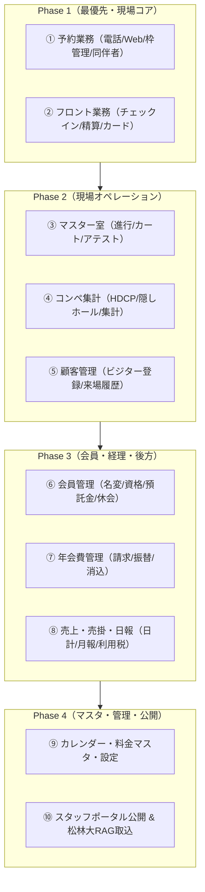

# TSH SwingClub マニュアル「利用者目線」再構築 企画書

> **作成日**: 2026-08-17
> **作成者**: Agy（Antigravity）＆ オサケンさん
> **ステータス**: 企画・実行フェーズ1着手

---

## 1. 背景と課題（Why）

### 既存マニュアル（TSH原典 2009年版〜）の課題
1. **システム構造中心（機能仕様書型）**:
   - 「画面のボタン一覧」「入力欄の定義」が羅列されており、「業務で何を達成したいか（Jobs-to-be-Done）」が見えない。
2. **前提知識・暗黙知のブラックボックス化**:
   - 例：「席の氏名欄に文字が入っていないと来場人数としてカウントされない」「会員紐付けは半角カナ検索が必須」「資格マスタが当日料金を決定する」など、システムの致命的な前提や癖が現場の口伝や手探りになっている。
3. **現場での検索性・視覚性の不足**:
   - 紙や分厚いPDF、古いテキストファイルであり、現場スタッフが「いま起きている事象」から逆引きできない。

### 目指す姿（To-Be）
- **「業務シナリオ・目的から探せる」利用者目線の実践ガイド**。
- **「やってはいけないNG操作・落とし穴（Why & Pitfalls）」の明記**。
- **Obsidian / TCCスタッフポータル / AI支配人（松林大）の知識ベースに直結する現代的ナレッジ基盤**。

---

## 2. 対象ユーザーと利用シーン（Who & Where）

| ユーザー層 | 主な利用シーン | 求める情報 |
|---|---|---|
| **フロント・予約受付** | 電話・Web予約受付、チェックイン、当日同伴者変更、精算 | 手順、カナ検索の作法、同伴者入力ルール、料金・資格の確認 |
| **マスター室・進行** | スタート管理、カート配車、組入替、アテスト、スコア登録 | タイムテーブル操作、枠の追加/削除、コース変更、天候対応 |
| **コンペ・営業担当** | コンペ登録、ハンディ計算、順位表・賞品印刷、法人対応 | コンペ集計手順、隠しホール設定、集客担当者連携 |
| **総務・経理（大西さん等）** | 会員名変、預託金、年会費消込、日計・月計、売掛請求 | 会員マスタ更新、入金消込手順、日報・利用税帳票出力 |
| **新任スタッフ・派遣** | 業務習得、初期オリエンテーション | 全体業務フロー、頻出操作チートシート、用語解説 |
| **社内AI（松林大 / Agy / Claudian）** | LINE自動予約、データ突合、障害調査 | データ構造のSSOT、必須バリデーション規則 |

---

## 3. 再構築の基本設計（How & Structure）

すべてのマニュアル章を以下の「利用者目線4層構造テンプレート」で統一します。

```markdown
# 【業務名】SwingClub 実践マニュアル

## 1. 5秒サマリー（この業務のゴールと基本フロー）
- 何をする業務か / 所要時間 / 主な画面
- 基本の3ステップ（図解 / フロー）

## 2. 目的別・操作手順（How to）
- シナリオA: 【標準】通常の操作手順（ステップ写真・UI再現）
- シナリオB: 【例外】変更・キャンセル・イレギュラー時の対応
- シナリオC: 【検索・照会】探したい情報の引き方

## 3. 現場の落とし穴 ＆ やってはいけないNG操作（Critical Rules）
- ⚠️ ここを間違えるとどうなるか（実例・影響範囲）
- 正しい回避策・現場の鉄則

## 4. 関連マスタ・システム裏側の仕組み（For Manager & AI）
- 関連するテーブル・マスタ・フラグ
- 他システム（LINE、Web、ポータル）との連動
```

---

## 4. 全体モジュール構成と優先順位（Scope & Roadmap）

原典20モジュールを、現場の利用頻度とインパクトに基づき4グループに再編・順次執筆します。



### 優先度一覧

1. **【最優先（即時着手）】予約業務（電話受付・Web連携・同伴者登録・枠管理）**
   - 理由：直近のLINE予約や現場オペレーションで最もトラブルが発生しやすく、ルールの言語化が急務。
2. **【高】フロント業務 ＆ チェックイン・精算**
   - 理由：毎朝のフロント混雑時、新人や応援スタッフが迷わず動けるようにする。
3. **【高】マスター室業務 ＆ コンペ集計**
   - 理由：スタート時間変更やスコア集計の現場ミスを防ぐ。
4. **【中】会員管理 ＆ 年会費・売掛**
   - 理由：大西さん等の専門業務の標準化・属人化解消。
5. **【中】後方日報・利用税・マスタ管理**
   - 理由：月次・日次帳票の整合性担保。

---

## 5. 本日の実行タスク

- [x] 企画書策定・基本設計・テンプレート定義（本ドキュメント）
- [ ] **パイロット第1弾: 『SwingClub利用者マニュアル 01_予約業務編』 の作成**
  - 原典 `kb/予約.md` + 直近のSSOT `2026-08-15_SwingClub予約の作法_マニュアル準拠SSOT.md` を融合
  - 代表者・同伴者の入力ルール（`***` と空欄、氏名複製禁止）
  - 半角カナ検索による会員・資格・電話番号の芋づる自動紐付け
  - キャンセル・変更・枠の色の意味
- [ ] オサケンさんへの進捗共有とフィードバック受領
