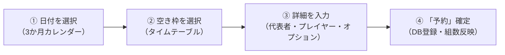

# 【予約業務】SwingClub 実践マニュアル（利用者目線版）

> **対象**: フロント受付、予約担当、マスター室、支配人、社内AI（松林大 / Agy / Claudian）
> **原典**: TSH SWING基幹システム マニュアル ＜予約＞（2009年版）＋ 2026年現場実測・SSOT準拠
> **作成日**: 2026-08-17
> **ステータス**: 正本（利用者目線・実務直結）

---

## 1. 5秒サマリー（予約業務の全体像と基本フロー）

- **主な画面**: 予約初期画面（3か月カレンダー ＋ タイムテーブル） ➔ 予約詳細登録画面
- **所要時間**: 通常1組 30秒〜1分
- **ゴール**: お客様の希望日時・スタート枠を確実に確保し、当日スムーズにチェックイン・精算できるよう会員・資格・プレイヤー情報を正しく紐付ける。

---

## 2. 目的別・操作手順（How to）

### シナリオ1: 【基本】1組（一般・会員）の予約受付

1. **日付を選ぶ**:
   - 画面左上の「3か月カレンダー」から希望日をクリック。
   - ※数字はその日の予約組数。ボーダー組数超で**黄色**、満員で**赤色**になります。
2. **スタート時間枠を選ぶ**:
   - 画面右側の「タイムテーブル」から、希望コース・空いている時間枠をクリックして青色反転させます。
   - 画面上部または右側の「**予約**」ボタンをクリック。➔「予約詳細登録」画面が開きます。
3. **予約者（代表者）を入力する（★最重要手順）**:
   - 予約者が**会員様**の場合：
     1. 「会員／ゲスト」で「会員」にチェックが付いていることを確認。
     2. 「**氏名カナ**」欄に**半角カタカナ**で姓を入力して **[Enter]** キーを押す。
     3. 検索候補から該当者を選択すると、**会員番号・漢字氏名・電話番号・性別・HDCP** が自動でセットされます。
   - 予約者が**ビジター様**の場合：
     1. 「会員／ゲスト」で「ゲスト」にチェックを入れる。
     2. 氏名カナ（半角）を入力して [Enter]（ビジタマスタ検索）。未登録の場合は漢字氏名・電話番号を直接入力。
   - 予約者が当日プレーする場合：
     - **「プレイヤー1にコピー」ボタンをクリック**（プレイヤー1の欄に代表者情報が自動転記されます）。
4. **同伴プレイヤーを入力する**:
   - 同伴者の名前が分かっている場合：
     - プレイヤー2〜4の「氏名」欄に入力（会員なら氏名カナ→Enterでマスタ検索）。
   - 同伴者がまだ未定の場合：
     - **空欄のままでOK**（代表者の名前をコピーして埋めるのは**絶対禁止**）。
     - ※原典仕様では番号クリックで `***` を入れる機能もありますが、現場では空欄のまま登録するのが通例です。
5. **オプション（キャディ・カート・備考等）を設定する**:
   - キャディ付き希望：画面中段「オプション」タブで「キャディ」にチェック。
   - 特記事項（連絡事項、到着遅れ、リクエスト等）：「備考」欄に入力。
6. **予約を確定する**:
   - 画面右下の「**予約**」ボタンをクリックして完了。タイムテーブルに名前が反映されます。

---

### シナリオ2: 【コンペ・複数組】2組以上の団体予約

1. **複数枠を選択する**:
   - タイムテーブル上で、連続するスタート時間枠をドラッグまたは複数クリックして選択します（例：東コース 8:00, 8:07, 8:15 の3枠）。
   - 「**予約**」ボタンをクリック。
2. **グループ名・コンペ名の設定**:
   - 「予約者情報」の「グループNO」横にある「**自**」ボタンをクリック（空きグループ番号が自動採番されます）。
   - 「グループ名」欄にコンペ名・会社名等を入力（例：「〇〇商事ゴルフコンペ」）。
3. **組ごとのプレイヤー入力と切り替え**:
   - 画面右下の「**次頁**」「**前頁**」ボタンで組を切り替えます（例：「1/3組」「2/3組」と表示）。
   - 各組のプレイヤー1〜4を入力。
4. **パーティ・料理・賞品等の設定**:
   - 「オプション」タブにて、パーティ有無、部屋（ルーム）、料理コース、送迎バス等を選択。
   - 「備考コピー」ボタンを押すと、全組の備考欄に同一内容が一括反映されます。
5. **「予約」ボタンをクリックして確定**。

---

### シナリオ3: 【変更・キャンセル】当日の組数変更やキャンセル対応

#### A. プレイヤーの交代・変更
- 該当枠を開き、「予約詳細登録」画面でプレイヤー名を書き換えて「**予約**」ボタンを押す。
- または、初期画面の「**アクション**」➔「**個人入れ替え**」を使い、タイムテーブル上でプレイヤー枠同士をクリックして入れ替える。

#### B. 予約のキャンセル
1. タイムテーブルでキャンセルしたい枠を選択。
2. 処理ボタン「**キャンセル関連**」➔「**キャンセル処理**」をクリック。
3. キャンセル情報画面で、必要に応じて「操作者」「理由（雨天、体調不良、都合等）」を選択・入力。
4. 「**キャンセル**」ボタンをクリック（枠が空枠に戻り、キャンセル履歴に保存されます）。

#### C. キャンセル復活（誤ってキャンセルした／再来場）
1. 予約を入れたい空枠を選択。
2. 「**キャンセル関連**」➔「**キャンセル復活**」をクリック。
3. 日付や名前でキャンセル履歴を検索し、対象データを選択して「**復活**」をクリック。

#### D. キャンセル待ちの登録
- 満員時にキャンセル待ちを受ける場合：
  - 枠を選択せずに「**キャンセル関連**」➔「**キャンセル待ち登録**」をクリックし、お客様情報を登録。
  - 後日空きが出た際、「**キャンセル待ち予約登録**」からワンクリックで本予約へ移行できます。

---

### シナリオ4: 【検索・照会】予約の確認・空き状況の確認

- **お客様から「予約入ってる？」と電話があった時**:
  - 「**検索**」➔「**予約検索**」をクリック。
  - カナ氏名・電話番号・プレー日等の条件を入れて「検索」。
  - 該当データをダブルクリックすると即座に予約詳細画面が開きます。
- **「空いてる時間帯ある？」と聞かれた時**:
  - 「**検索**」➔「**空枠検索**」をクリック。
  - 午前/午後、スタート時間帯、組数を指定して一括照会。

---

## 3. 現場の鉄則 ＆ 絶対にやってはいけないNG操作（Critical Rules）

> ⚠️ **ここを間違えると、現場での精算事故やお客様への失礼、集計狂いに直結します！**

| やってはいけないNG操作 | なぜダメか（事故の結末） | 正しい現場の作法 |
|---|---|---|
| 🔴 **同伴者欄に代表者の名前をコピーして埋める** | 当日フロント画面に「長田 賢一郎」が4人並び、実際の同伴者の名前が抹殺される。チェックイン・精算で大混乱になる。 | 同伴者が未定の場合は**空欄**にする（代表者コピーボタンはプレイヤー1専用）。 |
| 🔴 **「資組一括」「資G一括」を安易に押す** | 会員の「資格（メンバー料金）」が同伴ビジター全員にコピーされ、**ビジターが会員料金で誤精算される（売上損失事故）**。 | 資格一括コピーは使わない。同伴者の資格は空欄のままとし、当日フロント確認に任せる。 |
| 🔴 **会員番号を手打ち入力する** | カナ検索を通さないと、会員マスタの最新情報（電話番号・資格・連絡先）が芋づる式に反映されず、データが不整合になる。 | **必ず「氏名カナ（半角）」に入れて Enter キーでマスタ検索する。** |
| 🔴 **同伴者に代表者の会員番号を付ける** | 同伴者のプレー代が代表者の口座や売掛に誤請求される。 | 会員番号・ビジターIDは**本人の枠（席）のみ**に付ける。同伴者がゲストなら空欄。 |
| 🔴 **調整枠（グレー色）に無理やり予約を入れる** | ゴルフ場がコースメンテナンスや進行調整のために意図的に止めている枠。進行遅延や組詰まりの原因になる。 | 時間色設定の「調整枠」は触らない。枠を空ける必要がある場合はマスター室に確認。 |

---

## 4. 画面・システム裏側の仕組み（For Manager & AI）

### タイムテーブルの色の意味

| 色・表示 | 意味 | 現場での判断 |
|---|---|---|
| **白** | セルフプレー予約 | 通常のセルフ枠 |
| **青 / 緑（設定色）** | キャディ付き予約 | キャディ手配が必要な組 |
| **グレー / 調整色** | 調整枠（予約不可） | 予約受付不可（コース間隔調整・整備） |
| **「K」表示** | 仮予約 | 正式決定していないキープ枠（組数集計には含まれない） |
| **「2B」「3B」** | 人数限定枠 | 2人・3人専用枠（それ以上の人数は登録不可） |
| **WEBプラン番号** | インターネット予約連携枠 | 0＝ネット公開中（空き）、番号あり＝GDO/楽天等からの予約確定 |

### データ構造（3層モデル）
1. **予約枠・クラス層（`T_GXXCLASS`）**: スタート時間、コース、枠の色、ロック状態
2. **予約ヘッダ層（`T_GXXTEAM`）**: 予約代表者情報、グループ名、受付者、コンペ情報
3. **プレイヤー・席層（`T_GXXPLAY`）**: 席1〜4の氏名、カナ、会員番号（`kokyaku_no`）、資格（`sikaku_no`＝料金キー）

> 💡 **AI・連携システムへの申し送り**:
> - 会員紐付けの正路は「半角カナ検索による会員マスタ照会」。
> - 席の客区分（`kokyaku_kbn`）は、会員なら `1`（+6桁番号）、ビジターなら `2`（+V番号）、未紐付けは `0` または `null`。
