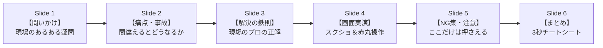
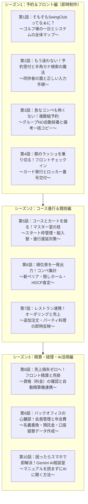

# 【企画書】SwingClub-CLOUD 利用者目線「紙芝居」スライド動画シリーズ

> **プロジェクト**: 津カントリー倶楽部 SwingClubマニュアル利用者目線再構築
> **企画名**: 1分半でわかる！SwingClub 現場実践「紙芝居」シリーズ
> **作成日**: 2026-08-17
> **作成者**: Agy（Antigravity）＆ オサケンさん
> **形式**: 16:9 横型スライド動画（Web・ポータル・YouTube限定公開用）＋ 9:16 縦型（スマホ視聴・LINE用）

---

## 1. 企画の背景とコンセプト（Why & Concept）

### なぜ「紙芝居」なのか？
- **文字マニュアルは現場で読まれない**:
  - 朝のフロント、忙しいマスター室、新人の休憩時間に、分厚いマニュアルや長文テキストを読む余裕はありません。
- **「1スライド1メッセージ」の絵コンテ × 音声ナレーション**:
  - 画面スクショ、大きな赤丸・矢印、明確なキャッチコピー、心地よいナレーション（ElevenLabs）を組み合わせた**「紙芝居」形式**にすることで、流し見するだけで**「やってはいけないNG操作」と「正しい操作手順」**が直感的に脳へ焼き付きます。

---

## 2. 紙芝居の基本フォーマット（1話 90秒・全6スライド構成）

すべての紙芝居を以下の「王道ストーリーテリング構造」で統一します。



| スライド | 時間 | 画面構成 | ナレーション・メッセージの要点 |
|---|---|---|---|
| **S1: 問いかけ** | 10秒 | タイトル ＋ 現場キャラクターの疑問イラスト | 「同伴者の名前がまだ決まってない…とりあえず予約者の名前を入れておけばいい？」 |
| **S2: 事故の結末** | 15秒 | 焦るフロント画面（NGシーンのスクショ） | 「それ、絶対NGです！フロント画面に同じ名前が4人並んで、当日のチェックインと精算が大パニックに…！」 |
| **S3: 現場の鉄則** | 15秒 | 大きな太字の結論 ＋ 正しいルール | 「正解は『空欄』！未定の席はあえて空けておくのが現場のプロの作法です。」 |
| **S4: 画面実演** | 25秒 | SwingClub実機画面 ＋ 赤丸・番号・矢印 | 「操作は3ステップ。①氏名カナに半角カナを入れてEnter ➔ ②プレイヤー1にコピー ➔ ③同伴者は空欄で『予約』！」 |
| **S5: やってはいけないNG** | 15秒 | 警告アイコン ＋ NG操作リスト | 「注意！『資組一括』ボタンを押すと、ゲストに会員料金がコピーされて精算事故になります！」 |
| **S6: まとめ** | 10秒 | 3大ルールの一覧 ＋ 終了コール | 「半角カナで検索、同伴者は空欄、資格コピーは触らない。これで予約受付は完璧です！」 |

---

## 3. 全10話 シリーズ構成（ロードマップ）

現場の業務ストーリー（来場前 ➔ 朝 ➔ コース ➔ レストラン ➔ 夕方 ➔ 月次）に沿った全10話構成です。



---

## 4. 制作パイロット第1弾：第2話「予約受付と半角カナ検索の魔法」絵コンテ

早速、第1弾として制作する第2話の具体的な絵コンテ（台本・ビジュアル指定）です。

### 絵コンテ詳細

```
【第2話 絵コンテ】
尺：約80秒 / 音声：ElevenLabs（明るく明瞭な女性ナレーション / または男性プロナレーション）
BGM：軽快で落ち着いたアコースティックBGM（音量20%ダッキング）

[Slide 1: 表紙]
ビジュアル: 「予約受付 3つの鉄則」の文字 ＋ 電話を受けるスタッフのイラスト
ナレーション: 「ゴルフ場の予約受付、同伴者の名前がまだ決まっていないとき、とりあえず予約者の名前で埋めていませんか？」

[Slide 2: 事故シーン]
ビジュアル: フロント受付の画面に「長田 賢一郎」「長田 賢一郎」「長田 賢一郎」「長田 賢一郎」と4つ並んでいるスクショ（赤色バツ印 ❌）
ナレーション: 「それ、実は大事故のもとです！フロント画面に同じ名前が並んでしまい、当日のチェックインと精算で大混乱になってしまいます。」

[Slide 3: 結論]
ビジュアル: 「同伴者未定 ＝ 【空欄】のままでOK！」の大きな緑文字（チェックマーク ✅）
ナレーション: 「正解は『空欄』！未定の同伴者はあえて空けておくのが、現場の正しい作法です。」

[Slide 4: 実機操作実演]
ビジュアル: SwingClub予約詳細登録画面のスクショ
  - ①「氏名カナ」に赤い丸枠 ➔ 「半角カナでEnter」
  - ②「プレイヤー1にコピー」に青い丸枠
  - ③「プレイヤー2〜4」に緑の点線枠 ➔ 「空欄」
ナレーション: 「手順はシンプル。氏名カナに半角カタカナを入れてEnterを押すと、会員マスタから電話番号や資格が自動でセットされます。予約者がプレーする場合は『プレイヤー1にコピー』を押し、同伴者は空欄のまま予約ボタンを押せば完了です。」

[Slide 5: NG操作アラート]
ビジュアル: 「資組一括」「資G一括」ボタンに危険ドクロマーク ⚠️
ナレーション: 「注意！『資組一括』ボタンを押すと、会員料金がゲスト全員にコピーされ、誤精算のトラブルになります。資格は触らず空欄にしておきましょう。」

[Slide 6: まとめ]
ビジュアル: 
  1. 半角カナ検索で自動セット
  2. 同伴者未定は「空欄」
  3. 資格一括コピーは触らない
ナレーション: 「半角カナで検索、同伴者は空欄、資格コピーは触らない。この3つで予約業務は完璧です！」
```

---

## 5. 実装・配信パイプライン（How to Deliver）

1. **スライド制作**:
   - HTML / Canvas / 画像生成ツールで16:9高解像度スライド画像を自動生成（`_attachments/slides/`）。
2. **音声生成**:
   - ElevenLabs APIで台本ナレーションを自動生成（`_attachments/audio/`）。
3. **動画合成（FFmpeg）**:
   - スライド画像 ＋ 音声 ＋ BGM ＋ フェードトランジションを自動結合してMP4生成。
4. **配信・掲載**:
   - YouTube限定公開アップロード（`youtube-uploader`）
   - レスポンシブWebマニュアル（`index.html`）の各章上部プレイヤーに埋め込み。
   - TCCスタッフポータルへの掲載。
