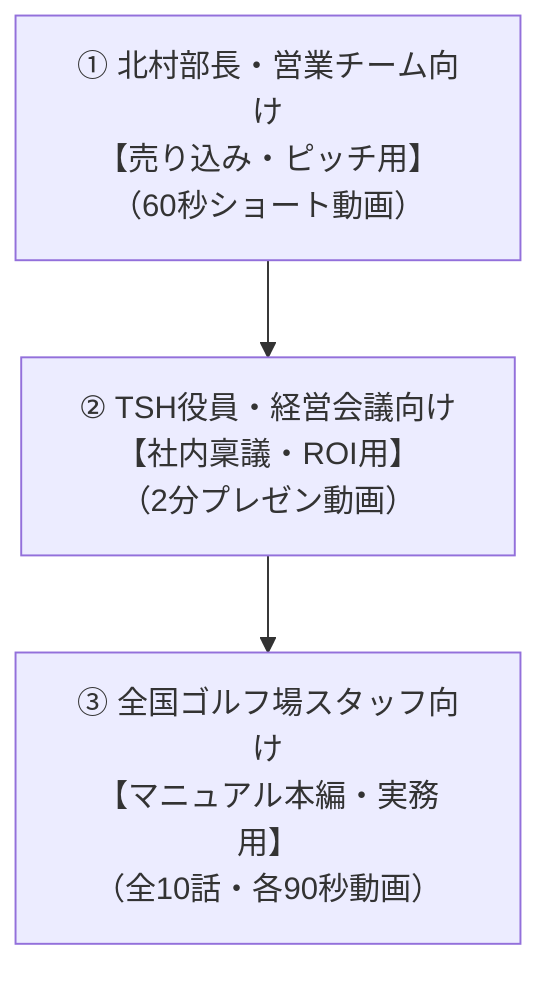

# 【紙芝居展開計画】3ターゲット別 スライド動画シリーズ構想

> **作成日**: 2026-08-17
> **作成者**: Agy（Antigravity）＆ オサケンさん
> **形式**: 16:9 横型スライド動画 ＋ 音声ナレーション（ElevenLabs）

---

## 1. ターゲット別の役割と構成

紙芝居（スライド動画）を「売り込み」「社内稟議」「現場実務」の3段階で展開します。

---

## 2. 各ターゲットの詳細絵コンテ

### ① 【北村部長向け】売り込み用ショート紙芝居（60秒）
- **目的**: 北村部長がスマホで見て「これは面白い！うちに欲しい！」と一瞬で共感してもらう。
- **構成**:
  - **S1（問いかけ）**: 「北村さん、全国のゴルフ場から『初歩的な操作の問い合わせ』で電話が鳴り止まないことはありませんか？」
  - **S2（現場の現実）**: 「現場スタッフは分厚いマニュアルを読めず、先輩の口伝で操作してミスを起こしています。」
  - **S3（解決の提示）**: 「そこでTCCが開発したのが、この『スマホで1分でわかる紙芝居マニュアル ＆ Gemini AI相談室』です。」
  - **S4（実機デモ）**: 「手元のスマホでスクショと赤丸で直感理解。AIに質問すれば1秒で即答。」
  - **S5（オファー）**: 「これをTSHの公式ポータルとして全国200コースに展開しませんか？制作はすべてTCCチームが請け負います。」

---

### ② 【TSH役員・経営陣向け】稟議用プレゼン紙芝居（2分）
- **目的**: 北村部長が役員会・経営会議の冒頭で再生し、役員の合意を一発で取り付ける。
- **構成**:
  - **S1（タイトル）**: 「SwingClub-CLOUD ユーザーポータル導入によるサポートコスト削減と拡販戦略」
  - **S2（課題と試算）**: 「現在、月間300件の操作問い合わせにサポート工数を圧迫。年間約360時間のロスが発生。」
  - **S3（投資対効果 ROI）**: 「Webポータル・動画・AIの導入により問い合わせを40%削減。新規導入時の講習コストも半減。年間約380万円のコストを抑制。」
  - **S4（競合優位性）**: 「他社システムにはない『AIヘルプデスク標準装備』により、クラウド版の成約率が向上。」
  - **S5（制作委託の妥当性）**: 「実務と基幹DBを熟知する津カントリー倶楽部DXチームへ一括委託（350万円）。内製・一般外注（800万〜）の半額で短納期納品。」
  - **S6（結論）**: 「単年度で投資回収が可能な戦略的DX投資として、本件の承認をお願いいたします。」

---

### ③ 【全国ゴルフ場スタッフ向け】マニュアル本編（全10話）
- **第1話〜第10話**: 各90秒、現場の実務フロー、やってはいけないNG操作、3秒チートシート（前述の `02_企画書_SwingClub紙芝居スライド動画シリーズ.md` 準拠）。
