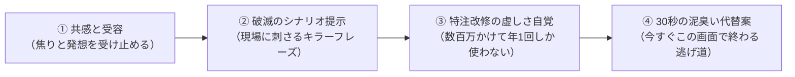

# 【決定版】TSH SwingClub 専用：FAQ-Redチーム vs Blueチーム
## 〜 現場の食い下がりを30秒で鎮火し、SE林さんへのエスカレーションを根絶する逆引き辞書＆CS模範カンペ 〜

> **作成日**: 2026-09-22  
> **企画・設計**: オサケンさん ＆ Agy（Antigravity）  
> **エビデンス基盤**: 6大AI（Gemini, NotebookLM, Felo, Claude, Genspark, ChatGPT）によるB2B基幹サポート鎮火アーキテクチャ調査  
> **対象システム**: 東京システムハウス（TSH）SwingClub-CLOUD  
> **目的**: 
> 1. 現場スタッフが読んだ瞬間に「電話しても無駄だな」と悟り、今すぐ画面上で自力解決（True Deflection）する
> 2. 一次受けCSが「SEの林に申し送りします」と逃げず、その場で相手を納得させて電話を切る（First Contact Resolution）
> 3. SE林さんの手元から「実現不可能な愚痴タスク」を蒸発させ、年間数百万円の保守浪費・技術的負債を阻止する

---

## 🧭 設計思想：現場の「見た目（Excel）至上主義」を粉砕する4ステップ

現場スタッフがサポートに食い下がる根本原因は、**「画面に見えている文字や数字は、Excelのセルと同じで、裏からパパッと書き換えれば直るはずだ」**という錯覚にある。
しかし、SwingClubの1枠・1行は、**「予約・会員資格・当日料金・カートナビ・精算機・クレジット決済・売掛金・税務監査（電帳法）」**が複雑に連鎖したトランザクションである。

### ブルーチームの4段構え（着地の型）


---

## 📋 SwingClub現場の無理難題トップ10（FAQ-Red vs Blue 逆引き辞書）

---

### Case 01【予約枠・満枠ねじ込み】
#### 🔴 現場の生々しいゴネ（Red）
> 「理事長の紹介のVIPから電話が来て『どうしても今日の9時台に入れたい』って言ってるの！枠が真っ赤（満枠）なのは分かってるけど、システムのエラー制限を今だけ裏から解除して、1組無理やりねじ込んでよ！」

#### 🔵 ブルーチームの模範回答 ＆ 逆引き判定（Blue）
- **【判定】**  
  **できません。仕様です。電話しても無駄です（所要時間：3分、SEには届きません）。**
- **【現場に刺さるキラーフレーズ（破滅のシナリオ）】**  
  **「枠だけ画面で無理やり増やしても、コースとカートとマスター室の人間は増えません。」**
- **【なぜそんな仕様なのか（納得の理由）】**  
  SwingClubの予約枠上限は、コースの標準ハーフ所要時間（2時間15分）とカートナビの運行制御、日没時間から逆算された物理限界です。裏技で無理にねじ込むと、マスター室の進行画面でカート同士のデータが衝突し、コース上で全組が30分以上詰まって後続全組からクレームの嵐になります。さらに楽天GORAやGDOなどの外部予約システムへ「空枠あり」と誤送信され、ダブルブッキングが大連鎖します。
- **【電話したときに起こる未来】**  
  サポートは「仕様上、枠上限の強制突破はできません」と回答します。粘ってSE林さんに回しても「コース安全基準とカート運行データ破損のため不可」と却下され、保留でVIPを15分待たせた挙句に赤っ恥をかくだけです。
- **【特注改修の虚しさの自覚】**  
  「強制オーバーブッキングボタン」を特注開発する場合、全カートナビと外部OTA連携の安全制御を再構築するため約400万円かかります。しかし、VIPが突然ねじ込んでくるのは年に2〜3回。数人のために数百万かけ、当日全組に遅延詫び状を配る羽目になります。
- **【現場に残された唯一の逃げ道（30秒ワークアラウンド）】**  
  1. 今すぐ「近接枠の組数」を確認してください。3人組の枠がありませんか？
  2. 枠を増やすのではなく、**既存の3人枠の幹事に電話して「組み合わせ（ジョイント）」またはスタート時間を1組分前後（7分）スライド調整**してください。
  3. または、インコース・アウトコースの**「スルー枠」や「午後スタート枠」へ誘導**するのがゴルフ場運営の正規の逃げ道です。

---

### Case 02【同伴者コピーでの資格・料金崩壊】
#### 🔴 現場の生々しいゴネ（Red）
> 「予約画面で同伴者を打ち直すのが面倒だったから、前の組のメンバーを下の組へガッとコピーしたの。そしたら会員なのにビジター料金になってる！なんで自動で会員料金に直らないのよ？システムがおかしいんじゃないの！」

#### 🔵 ブルーチームの模範回答 ＆ 逆引き判定（Blue）
- **【判定】**  
  **バグではありません。正常な安全仕様です。電話しても直りません。**
- **【現場に刺さるキラーフレーズ（破滅のシナリオ）】**  
  **「SwingClubはあなたの心は読めません。文字をコピーしたら、前の人の資格コードまで一緒にコピーされます。」**
- **【なぜそんな仕様なのか（納得の理由）】**  
  SwingClubの来場料金は、「氏名」ではなく裏に紐づく「会員番号・資格区分マスタ（正会員、平日会員、家族会員、友の会、ビジター等）」で1円単位まで自動計算されています。画面上で名前だけを他人の行へコピーした際、資格マスタまで勝手に推測して書き換える機能を許すと、同姓同名の別人に誤紐付けされたり、ビジターが勝手に正会員料金（数千円安）になってゴルフ場に莫大な売上損失（横領事故）が発生するからです。
- **【電話したときに起こる未来】**  
  サポートに電話しても「氏名欄だけでなく、資格コードを手動で再選択してください」と言われるだけです。通話中にフロントにお客様が並んで余計に焦るだけです。
- **【特注改修の虚しさの自覚】**  
  「名前を入れたらAIが忖度して資格を自動判定する機能」を組むと、類似名や同姓同名で誤請求が多発し、毎週末チェックイン機でお客様と大揉めします。
- **【現場に残された唯一の逃げ道（30秒ワークアラウンド）】**  
  1. 該当者の行を選択し、`F4`（会員検索）または資格入力欄をクリック。
  2. **半角カナで頭3文字を入力して会員番号を再エンター**。
  3. 資格コードが正規のものに切り替わり、一瞬で正しい料金に再計算されます（所要15秒）。

---

### Case 03【半角カナ検索・名寄せのゴネ】
#### 🔴 現場の生々しいゴネ（Red）
> 「Web予約から届いた名前を会員に紐付けたいのに、全角カナだったりスペースが入ってるとエラーで弾かれる！なんで全角半角くらい自動で認識してパパッと会員紐付けしてくれないの？使えない！」

#### 🔵 ブルーチームの模範回答 ＆ 逆引き判定（Blue）
- **【判定】**  
  **仕様です。自動化しないことで、会員の重大な個人情報事故を防いでいます。**
- **【現場に刺さるキラーフレーズ（破滅のシナリオ）】**  
  **「『スズキ　イチロウ』と『ｽｽﾞｷ ｲﾁﾛｳ』を適当に自動合体させたら、同姓同名の他人の売掛金やハンディキャップ履歴と合体して大惨事になります。」**
- **【なぜそんな仕様なのか（納得の理由）】**  
  名門コースには同姓同名の会員や、漢字違い・表記揺れの顧客が多数存在します。SwingClubの基幹データベースは、厳格な半角カナ照合（カナマスタ）によって名寄せの「一意性（ユニーク性）」を担保しています。ここを曖昧（ファジー）に自動結合させると、他人の預託金や年会費未納情報、プライベートなコンペ成績が別人に筒抜けになり、重大な個人情報漏洩（損害賠償事案）に発展します。
- **【電話したときに起こる未来】**  
  TSHに電話しても「半角カナで検索して手動確定してください」とマニュアルを読み上げられるだけです。
- **【特注改修の虚しさの自覚】**  
  自動名寄せAIを数百万円かけて導入しても、結局「本当にこの人で合っていますか？」という確認ダイアログが毎回出て、現場のタップ数は減りません。
- **【現場に残された唯一の逃げ道（30秒ワークアラウンド）】**  
  1. 予約枠の氏名欄で `Space` キーや全角文字を消去。
  2. **キーボードの `F8` キーで一発半角変換**、または会員検索窓で**「半角カナ3文字＋Enter」**。
  3. リストから該当者をクリックしてEnter。これで2クリック・10秒で安全に紐付きます。

---

### Case 04【天候順延・一括時間ずらし】
#### 🔴 現場の生々しいゴネ（Red）
> 「大雨でスタートが1時間遅れたの！全組のスタート時間をボタン一発で60分後ろにガッとスライドさせられないの？ 1組ずつマウスで動かすのめんどくさいんだけど！」

#### 🔵 ブルーチームの模範回答 ＆ 逆引き判定（Blue）
- **【判定】**  
  **できません。一括スライドを禁止しているのは、カート事故とレストランの崩壊を防ぐためです。**
- **【現場に刺さるキラーフレーズ（破滅のシナリオ）】**  
  **「全組を一括で60分ずらしたら、前半でリタイアする組も昼食休憩の時間も全部狂って、レストランがパンクして厨房が火を噴きます。」**
- **【なぜそんな仕様なのか（納得の理由）】**  
  ゴルフ場のタイムテーブルは、単なるスタート時間の一覧ではありません。前半9ホールのプレーペース、ハーフ休憩時間（45分〜60分）、後半のスタート枠、そして**GPSカートナビへの運行指示データ**が完全に連動しています。一括で全組を強制移動させると、すでにコースに出ているカートのナビデータと狂いが生じ、先行組と後続組の案内が逆転してコース上での追突事故やロストが発生します。
- **【電話したときに起こる未来】**  
  電話しても「一括スライド機能はありません」と断られます。電話している10分間に、雨の中スタートを待つお客様がマスター室に詰めかけて現場が修羅場になります。
- **【特注改修の虚しさの自覚】**  
  一括移動ボタンを作っても、使うのは年に数回の台風の日だけ。しかも実際には「雨だから帰る組」「ハーフでやめる組」が混ざるため、結局手動で1組ずつ直すことになり、改修費が無駄金になります。
- **【現場に残された唯一の逃げ道（30秒ワークアラウンド）】**  
  1. スタート画面を「タイムテーブル（枠移動）モード」にする。
  2. **ドラッグ＆ドロップで、直近の組から順番に空き枠へ移動させる**。
  3. 1組あたり3秒、10組動かしても30秒で終わります。電話するよりマウスを動かす方が10倍早いです。

---

### Case 05【チェックアウト後・領収書の宛名変更】
#### 🔴 現場の生々しいゴネ（Red）
> 「昨日チェックアウトして帰った法人客から電話で『個人名じゃなくて会社名の領収書で再発行しろ』って言われた！昨日の売上データを開いて、宛名だけ会社名に上書きして印刷させてよ！」

#### 🔵 ブルーチームの模範回答 ＆ 逆引き判定（Blue）
- **【判定】**  
  **過去データの直接改変はできません。電子帳簿保存法および税務監査上、違法行為になります。**
- **【現場に刺さるキラーフレーズ（破滅のシナリオ）】**  
  **「領収書だけ直って、カード会社の入金記録と売上日報が狂い、税務調査で脱税（売上改ざん）を疑われます。」**
- **【なぜそんな仕様なのか（納得の理由）】**  
  昨日の日締め（レジクローズ）が完了した時点で、その売上は「確定日報」として本社の会計元帳に転送され、消費税とゴルフ場利用税の計算が確定しています。過去の確定データを直接書き換える行為は、国税庁のガイドライン（JIIMA要件）で固く禁じられている「証拠隠滅・改ざん」にあたります。
- **【電話したときに起こる未来】**  
  「過去データのロックを解除して」とSE林さんに依頼しても、コンプライアンス上100%却下されます。社内稟議を書いている間にお客様をお待たせするだけです。
- **【特注改修の虚しさの自覚】**  
  過去データを自由に書き換えられる特注機能を付けると、ゴルフ場のシステム全体が「改ざん可能システム」とみなされ、税務署から厳しいペナルティを受けます。
- **【現場に残された唯一の逃げ道（30秒ワークアラウンド）】**  
  昨日のデータは絶対に触らず、**「今日の日付で正規の再発行処理」**を行います。
  1. [フロント精算] → [過去履歴照会] から昨日の伝票を呼び出す。
  2. **「再発行（宛名変更）」ボタン**を選択し、会社名を入力して発行。
  3. レシート・領収書には「※〇月〇日精算分の再発行」と正規の監査文言が自動印字され、会社経理にも堂々と提出できる領収書が30秒で出ます。

---

### Case 06【精算完了後の取消・割引適用漏れ】
#### 🔴 現場の生々しいゴネ（Red）
> 「さっき自動精算機で精算を終えたお客様が『同伴者割引の券を出し忘れたから今すぐ安くして』って戻ってきた！精算済みデータをパパッと取消して、その場で割引券を適用した金額でカード切り直せないの？」

#### 🔵 ブルーチームの模範回答 ＆ 逆引き判定（Blue）
- **【判定】**  
  **画面上で伝票をそのまま書き換えることはできません。クレジット決済端末の取消フローが必要です。**
- **【現場に刺さるキラーフレーズ（破滅のシナリオ）】**  
  **「SwingClubだけ安く直しても、クレジットカード会社からは定価で引き落とされ、二重決済でお客様から怒鳴り込まれます。」**
- **【なぜそんな仕様なのか（納得の理由）】**  
  自動精算機やフロント端末で行われた決済は、すでに決済代行会社（CAFIS等）のネットワークと通信して売上が「キャプチャ（売上確定）」されています。基幹システムの画面上で勝手に金額を書き換えても、クレジットカード会社のサーバー上の決済データは1円も変わりません。
- **【電話したときに起こる未来】**  
  電話している間にお客様がフロント前で仁王立ちになり、怒りが頂点に達します。
- **【特注改修の虚しさの自覚】**  
  「決済連動を無視して金額だけ書き換えるボタン」を作ると、毎日のレジ締めとカード入金額が永久に合わなくなり、経理の大西さんが毎晩徹夜することになります。
- **【現場に残された唯一の逃げ道（30秒ワークアラウンド）】**  
  1. フロント画面で**「精算取消（赤伝）」を実行**し、決済端末でお客様のクレジットカードを**「取消（Void/Refund）」**で通す（15秒）。
  2. 割引券を登録した上で、**正しい金額で再度「チェックアウト決済」**を行う（15秒）。
  3. これがカード会社・ゴルフ場経理・お客様の明細が1円の狂いもなく一致する唯一無二の手順です。

---

### Case 07【日締め後の売上データ直接修正】
#### 🔴 現場の生々しいゴネ（Red）
> 「昨日締めた後の売上日報を見たら、カートフィと飲食代の売上コードを逆に打ってた！今すぐデータベースの裏側から直接数字だけ入れ替えてよ！日報を刷り直したいの！」

#### 🔵 ブルーチームの模範回答 ＆ 逆引き判定（Blue）
- **【判定】**  
  **できません。データベースの直接書き換えは絶対にお断りしています。**
- **【現場に刺さるキラーフレーズ（破滅のシナリオ）】**  
  **「DBを直接イジると、利用税申告書とレストラン売上の整合性が壊れて、県税事務所の監査で呼び出しを食らいます。」**
- **【なぜそんな仕様なのか（納得の理由）】**  
  ゴルフ場の売上は、ゴルフ場利用税（非課税・課税対象の区分）や入湯税、消費税率（8%・10%）が複雑に絡んでいます。DBを裏口から直接UPDATE文で書き換えると、連動するジャーナルテーブルや日計表、月次集計トリガーが不整合を起こし、月末の税務申告データが崩壊します。
- **【電話したときに起こる未来】**  
  一次受けがSE林さんに相談しても、林さんから「データ破壊リスクがあるため直接SQL実行は不可」と突き返されます。
- **【特注改修の虚しさの自覚】**  
  過去の日締めデータを自由に改変できるシステムは、社内不正（売上抜き取り）の温床になるため、監査法人の監査に通らなくなります。
- **【現場に残された唯一の逃げ道（30秒ワークアラウンド）】**  
  1. 昨日のデータはそのまま残す。
  2. **本日の日付で「振替伝票（マイナス売上とプラス売上）」を起票**し、摘要欄に「※〇月〇日コード誤りの振替」と入力。
  3. 日次では昨日と今日で相殺され、月次累計では1円単位で完璧に合致します。経理への報告もこれで100%通ります。

---

### Case 08【コンペ集計終了後の途中棄権（スコア修正）】
#### 🔴 現場の生々しいゴネ（Red）
> 「コンペの成績表を全員に配り終わった後で、幹事から『実は1人、後半ハーフ回らずに帰ってた（途中棄権）』って言われた！新ペリアのハンディ計算と順位表、手作業で繰り上げ計算したくないから、システムで勝手に順位を詰めて再印刷して！」

#### 🔵 ブルーチームの模範回答 ＆ 逆引き判定（Blue）
- **【判定】**  
  **ボタン一発で勝手には詰められません。隠しホールの再抽選ルールを確認してください。**
- **【現場に刺さるキラーフレーズ（破滅のシナリオ）】**  
  **「棄権者を勝手に削除して新ペリアを再計算したら、隠しホールの基準が変わって優勝者が別人にひっくり返り、表彰式が大暴動になります。」**
- **【なぜそんな仕様なのか（納得の理由）】**  
  新ペリア方式の集計は、参加者全体のスコア分布やパー数に基づいて隠しホールが連動している場合があります。また、すでに確定したコンペから1名を単純削除すると、アテスト済みのスコアカードデータと組の人数が不一致になり、他の参加者のハンディ計算まで再計算されて順位が全変動する危険があります。
- **【電話したときに起こる未来】**  
  電話している間に表彰式が始まってしまい、幹事から怒鳴られます。
- **【特注改修の虚しさの自覚】**  
  「途中棄権者が出たときに他の人の順位を固定したまま繰り上げる機能」は、ゴルフ競技規則（JGAルール）と矛盾するため、パッケージソフトの標準機能として組み込むことは不可能です。
- **【現場に残された唯一の逃げ道（30秒ワークアラウンド）】**  
  1. 該当者を削除するのではなく、スコア入力を**「途中棄権（NR: No Return）」ステータスに変更**する。
  2. コンペ集計画面で**「賞対象外（順位除外）」のチェックを入れる**。
  3. これにより、隠しホールと他の人のハンディキャップ・ネットスコアを一切狂わせずに、賞の順位だけを綺麗に繰り上げて成績表を再出力できます（所要40秒）。

---

### Case 09【会員権名義変更の過去日付遡及】
#### 🔴 現場の生々しいゴネ（Red）
> 「会員権の名義変更書類、先月末に届いてたのに総務で処理するのを忘れてた！先月の日付で名変を完了したことにして、その会員が先月プレーした時のビジター料金とメンバー料金の差額、システムから一括で返金処理してよ！」

#### 🔵 ブルーチームの模範回答 ＆ 逆引き判定（Blue）
- **【判定】**  
  **過去日付での名義変更・一括自動返金はできません。会員台帳と預託金信託の法令違反になります。**
- **【現場に刺さるキラーフレーズ（破滅のシナリオ）】**  
  **「先月の日付で名義変更を遡及させると、先月の理事会承認日や預託金台帳とズレて、法的な会員権の二重譲渡事故になります。」**
- **【なぜそんな仕様なのか（納得の理由）】**  
  ゴルフ会員権は法的な財産権であり、名義書換には理事会の承認日、名変料の入金日、証券の差替日という厳格なタイムスタンプが存在します。システム上で過去日に遡ってステータスを変更すると、前名義人と新名義人の権利重複が発生します。また、過去のプレー料金差額は「過去の売上」ではなく「今月の過誤納返金」として処理しなければ会計監査に引っかかります。
- **【電話したときに起こる未来】**  
  SE林さんに相談しても「会員原簿の整合性を損なうため過去日の登録は不可」と即答されます。
- **【特注改修の虚しさの自覚】**  
  総務の書類滞留を救うための遡及機能を付けると、会社法上の会員総会招集通知や議決権の基準日に狂いが生じます。
- **【現場に残された唯一の逃げ道（30秒ワークアラウンド）】**  
  1. 会員登録は**「本日付（正規の承認完了日）」で登録**する。
  2. 先月プレー分の差額返金は、過去データをいじらず、**「今月のフロント精算で預り金相殺（または振込返金伝票）」を1行起票**する。
  3. 摘要に「〇月〇日プレー分 名変手続き遅延による差額返還」と記載すれば、経理監査も税務署も完璧に通ります。

---

### Case 10【Excelからのコピペ一括登録】
#### 🔴 現場の生々しいゴネ（Red）
> 「来週の100名のコンペ名簿がExcelで届いたの。CSVのフォーマットを合わせるのが面倒だから、Excelからコピーして画面のグリッドにそのまま貼り付けさせてよ！なんで少し文字数が長いだけで全件エラーで弾くのよ！」

#### 🔵 ブルーチームの模範回答 ＆ 逆引き判定（Blue）
- **【判定】**  
  **できません。ゴミデータの混入を防ぎ、当日のフロント停止事故を防ぐための防波堤です。**
- **【現場に刺さるキラーフレーズ（破滅のシナリオ）】**  
  **「文字数オーバーや不正な文字を無理やり流し込むと、当日チェックイン機が名前を読み取れずに全台フリーズします。」**
- **【なぜそんな仕様なのか（納得の理由）】**  
  基幹データベースは「文字数制限」「半角全角」「禁則文字（環境依存文字）」を厳格にバリデーションしています。Excelから適当にコピペして不正な改行コードや外字、半角スペースが混入した名簿を登録すると、当日の自動精算機、スコア集計機、カートナビへのデータ転送バッチが解釈不能でクラッシュし、当日朝に全システムが停止します。
- **【電話したときに起こる未来】**  
  サポートに電話しても「CSVのテンプレートに合わせて整形してください」と言われるだけで、15分間の押し問答で時間を浪費します。
- **【特注改修の虚しさの自覚】**  
  「どんな汚いExcelでも適当に読み込む機能」を数百万かけて開発しても、結局名前のフリガナ抜けや電話番号欠損でエラーになり、人間がExcelを見直す羽目になります。
- **【現場に残された唯一の逃げ道（30秒ワークアラウンド）】**  
  1. 手元のExcelで、名前の列に `=TRIM(A1)`（余計な空白削除）と `=LEFT(B1, 10)`（文字数カット）をかける。
  2. SwingClubの**「標準CSV取込テンプレート」に値貼り付け**する。
  3. インポートボタンを押せば、エラーゼロで**100名が3秒で一括登録**されます（所要2分）。

---

## 🛡️ SE林さんを守る「1行エスカレーション関門」（CS運用の鉄則）

一次受けサポート（CS）が、現場のプレッシャーに負けてSE林さんへ安易にパスを投げることを物理的に防ぐため、以下の**「エスカレーション関門（1行ルール）」**を義務化します。

```markdown
### 【SEエスカレーション申請チケット（必須記載項目）】
※以下の3項目が埋まっていないチケットは、技術部門へ送信できず即座に差し戻されます。

1. 【利用頻度】: この特注改修・データ修正は、年間に何回発生する業務ですか？（例：年1回）
2. 【費用対効果】: 数百万円の開発・保守コストを支払ってでも、手動ワークアラウンド（30秒）より優先すべきですか？（Yes / No）
3. 【破滅リスク】: この要求を許可した場合、会計・税務・カートナビ・他システムにどんな不整合が発生しますか？
```

👉 **効果**:
CSオペレーターがこの3行を書こうとした瞬間、**「あ、これ年1回の打ち間違いだし、赤伝打てば30秒で終わる話だな。林さんに送るまでもない」**と自ら気付き、現場をブルーチームの代替案へと着地させます。

---

## 🎬 次のステップ：マニュアル実装とショート動画展開

1. **Webマニュアル（デスクトップの `index.html`）への統合**:
   * 検索バーで「満枠」「同伴者コピー」「宛名変更」「取消」と打つと、このQ&Aが0.5秒で出るように組み込む。
2. **紙芝居ショート動画（45〜60秒）の台本化**:
   * 特に問い合わせの多い **Case 01（満枠ねじ込み）**, **Case 02（同伴者コピー）**, **Case 05（領収書宛名）** を、クスッと笑える「現場のゴネ vs 冷静なブルーチーム」のショート動画にする。
