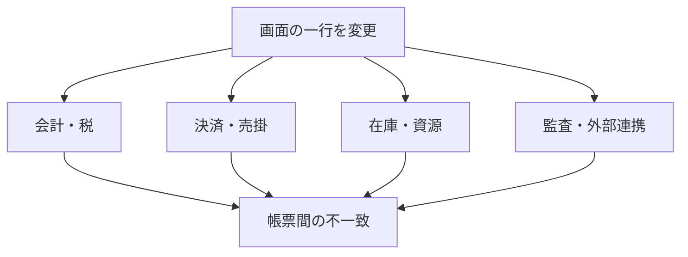

# B2B業務基幹システムにおける「できないことの相談・食い下がり」を鎮火するサポート設計

**副題：仕様相談を一次窓口で終結させ、SEへの直送をなくすための実務レポート**  
**調査日：2026-09-21**

---

## 0. エグゼクティブ・サマリー

結論は一つである。

> **「できません」と言うだけでは問い合わせは終わらない。**  
> 終わらせるには、①禁止理由を利用者の損失に翻訳し、②電話しても結果が変わらないことを明示し、③その場で完了する代替手順を同じ画面に出す必要がある。

一次受けからSEへのエスカレーションを減らす鍵は、話術よりも構造である。

1. **変更不能の理由を「DBだから」ではなく、壊れる業務の連鎖で示す**  
   例：「昨日の売上を直接書き換えると、カード入金・税区分・在庫・日報の四つが別の数字になります」
2. **拒否と代替案を分離しない**  
   「できません」で記事を終えず、「正規の取消／反対仕訳／追記／振替」を同じカード内に置く。
3. **SEへの直送を廃止し、障害ゲートだけを残す**  
   仕様・権限・操作・データ訂正はサポートで終結。再現可能な不具合、セキュリティ、患者安全、会計締め破損だけを所定の証拠付きで技術部門へ送る。
4. **Ticket Deflectionではなく Resolution を測る**  
   「電話されなかった数」だけでは、諦めて離脱した人まで成功に数えてしまう。代替手順の完了率、7日以内の再問い合わせ率、誤判定率を併記する。

### 重要な現実認識

「SEへのエスカレーション根絶」を文字どおり実行すると、真の不具合まで埋もれる。安全な目標は次の二つである。

- **顧客・一次受けから開発SEへの直接エスカレーション：ゼロ**
- **証拠の揃った障害・重大リスクを、技術トリアージへ送る経路：維持**

---

## 調査上の注記

現場の電話会話は機密であり、Web上に逐語録として公開されることはほぼない。本レポートでは、製品公式ドキュメント、規制当局資料、公開事例から確認できる制約を土台に、複数現場で起きる状況を**代表的な合成ケース**として再構成した。

- 表と対話劇の発言は、特定企業の実話や引用ではない。
- 技術的な制約と成功事例の数値には出典を付した。
- 金額・工数の例は、社内単価で再計算すべき説明用モデルである。

---

# 1. 現場が「これでは？ あれでは？」と食い下がる典型パターン5選

## 1-1. 一覧

| # | 業界・業務シーン | 現場の無理な要求・食い下がり | なぜゴネるのか | 許可してはいけない構造上の理由 | 正規の逃げ道 |
|---|---|---|---|---|---|
| 1 | **ホテルPMS：チェックアウト後、前日分の請求書を訂正** | 「昨日の宿泊料、金額だけ直接直せない？」「PDFを直して同じ伝票番号で出せば？」「日付を昨日に戻して再発行できない？」 | 目の前に法人客がいる。経理提出期限が迫る。フロントは“画面上の一行”に見えるため、後ろにある売上・税・決済を意識しない。 | 確定済みフォリオは、売上明細、税、売掛、カード決済、営業日、夜間処理、外部会計への連携単位になっている。文字や金額だけ上書きすると、請求書と元帳・決済・監査ログが不一致になる。Oracle OPERA Cloudも、前受請求の取消を元行の削除ではなく、マイナスの調整仕訳として記録する。 | 元取引を**Reverse／Adjust**し、理由を残して正しい金額を再計上。書式上の誤りだけなら、取引値を変えず備考・宛名の正規訂正機能を使う。 |
| 2 | **飲食POS：締め後の会計・商品・支払方法を変更** | 「昨日の現金をカード扱いに変えて」「この一品だけ消して売上もなかったことに」「同じ会計をもう一回部分返金できない？」 | レジ締め差異を今すぐゼロにしたい。客が待っている。店長にミスを知られたくない。伝票が一枚なので一レコードだと思う。 | 決済は認証→売上確定→入金のライフサイクルを持ち、商品別売上、税、チップ、在庫、担当者実績、キャッシュドロワーが連動する。Toastは当日・未確定ならvoid、前営業日以前の確定済み決済はrefundと明確に分け、変更履歴には誰が・いつ・どの端末で操作したかを残す。 | 当日なら権限者が取消して再会計。翌日以降は原決済に紐づく返金＋正しい新規売上。支払方法だけを過去伝票上で付け替えない。 |
| 3 | **病院電子カルテ：署名済み診療記録・患者情報を上書き** | 「病名を直接直して、古い文言は見えなくして」「前回カルテをコピーして日付だけ変えれば？」「別患者に入れた記録を移して消せない？」 | 会計・レセプト締切、診察の遅延、患者からの訂正要求。画面上は文書編集に見えるため、Wordのように置換できると思う。 | 診療記録は患者安全、請求、法的証拠、アクセス監査に関係する。日本の個人情報保護委員会は、電子カルテの加筆修正履歴も開示請求の対象になり得ると明示している。米HHSもePHIの不適切な改変・破壊を防ぐ完全性管理と監査記録を要求する。履歴を消す訂正は、誤投薬・別患者混入・説明不能を招く。 | 原記録を残し、**訂正／追記（addendum）**として作成者、日時、理由、正しい内容を追加。患者マスタの誤りは権限者が本人確認後に別手続で修正する。 |
| 4 | **レガシーERP：月次締め後の請求・仕訳を過去日に直接変更** | 「1月の請求書を一枚だけ開けて金額を直せない？」「DBを直接updateすれば早いでしょ」「締めを5分だけ解除して、また閉じれば？」 | 経理から“今日中”と言われる。現場には一枚の伝票だが、システム側では複数帳簿・税・債権・在庫原価・連結に波及する。 | NetSuiteは期間ロックを、総勘定元帳に影響する転記を防ぐための統制としている。過去期間を再オープンして変更すると、その後の閉鎖期間まで順番に再オープンされ得る。再評価、収益認識、連結為替、監査番号などの再確認が必要になる。 | 現行期間で取消・貸方・反対仕訳を作り、正しい取引を再計上。どうしても過去期間を開く場合は、経理責任者の変更管理案件であり、一次受けの即時操作にはしない。 |
| 5 | **施設・ゴルフ場・予約システム：満枠への強制差込み／一括移動** | 「VIPだから同じ枠にもう一組入れて」「雨だから全予約を30分ずつ後ろへ一括でずらして」「別画面で仮予約を作れば満枠判定を抜けられない？」 | 売上機会を逃したくない。受付に客がいる。天候など一時的事情に対し、通常ルールが邪魔に見える。 | 予約枠は単なる時刻ではなく、部屋・席・カート・人員・プラン・決済・外部チャネル・確認通知の集合である。同時変更は競合や二重確保を生む。Setmoreでも二重予約は標準では禁止され、管理者だけが有効化でき、顧客向け予約ページや繰返し予約には同じ扱いを広げていない。 | 空き資源へ分割、開始時刻変更、待機リスト、管理者承認付きの例外枠を使う。既存予約を一括上書きせず、対象者への同意確認後に個別再予約する。 |

## 1-2. なぜ「一行だけ直す」が危険なのか

業務基幹の画面に見える一行は、DB上の一行とは限らない。典型的には次のような依存関係がある。



現場に必要なのはDB講義ではない。**「どの数字が、誰の画面で、いつズレるか」**である。

### 業界別に使える破損説明

- ホテル：「領収書だけ直って、カード入金と売上日報が直りません」
- POS：「商品売上は減るのに、カード会社から入る金額は減りません」
- 電子カルテ：「訂正前の判断根拠が消え、誰がいつ変えたか説明できません」
- ERP：「1月だけのつもりでも、2月以降の残高・為替再評価・連結値が変わります」
- 予約：「枠だけ増えても、カート・部屋・担当者は増えません」

### 根拠資料

- Oracle OPERA Cloudは前受請求の取消を、元取引の消去ではなく、マイナスの調整チャージ・支払として記録する：<https://docs.oracle.com/en/industries/hospitality/opera-cloud/23.2/ocsuh/t_manage_billing_reversing_advance_bill_for_deposits.htm>
- RoomKey PMSも、全額取消、部分調整、別フォリオへの振替を別操作としている：<https://support.roomkeypms.com/a/413054-how-to-reverse-adjust-transfer-a-posting>
- Toastは決済確定前のvoidと、確定後のrefundを分離し、誤った処理はチェックを不整合状態にすると説明する：<https://support.toasttab.com/en/article/Voiding-Items-Payments-and-Checks>
- Toastの変更履歴は、担当者・時刻・端末・操作種別を記録する監査証跡である：<https://support.toasttab.com/en/article/View-Update-History-Feature1>
- 個人情報保護委員会は、電子カルテの加筆修正履歴も開示対象になり得るとしている：<https://www.ppc.go.jp/all_faq_index/faq3-qb6-1/>
- HHSのHIPAA監査プロトコルは、監査ログ、ePHIの不適切な改変・破壊の防止、改変されていないことを確認する仕組みを挙げる：<https://www.hhs.gov/hipaa/for-professionals/compliance-enforcement/audit/protocol/index.html>
- NetSuiteは、期間ロックをGLに影響する転記の防止に使う：<https://docs.oracle.com/en/cloud/saas/netsuite/ns-online-help/section_N1451780.html>
- NetSuiteの期間締めにはA/P、A/R、給与、全GLのロック、外貨再評価、収益認識、連結為替等が含まれ、過去期間の再オープンは後続期間にも及ぶ：<https://docs.oracle.com/en/cloud/saas/netsuite/ns-online-help/section_N1452509.html>
- Setmoreの二重予約は管理者設定であり、顧客向け予約ページや繰返し予約にはそのまま適用されない：<https://support.setmore.com/en/articles/490878-double-booking>

---

# 2. Blueチーム：SEにパスせず、その場で終結させる対話スクリプト

## スクリプトA：ホテルPMS「昨日の領収書を直接直して」

**状況**：法人客が、前日に確定した宿泊料の一部を別名目へ変更して再発行するよう要求。フロント担当がサポートへ電話。

### Step 1：共感と受容

**現場**：「昨日の領収書なんですが、宿泊料の一部を会議室代に変えて、同じ伝票番号で出し直したいんです。お客さまが目の前で待っています」

**一次受け**：「今ここで直して渡したい状況ですね。金額は同じで、内訳だけ変えたい。その発想になるのは自然です。まず、待たせずに渡せる方法までこちらで決めます」

**現場**：「なら、請求明細の文字だけ変えられませんか？」

### Step 2：破滅のシナリオを具体的に示す

**一次受け**：「文字だけに見えますが、その明細は税区分、売上科目、営業日、カード入金と結びついています。そこだけ上書きすると、今日渡す領収書は会議室代、昨日の日報と会計連携は宿泊料のままになります。月末に“同じ伝票番号なのに二つの内容”が残り、ホテル側が説明できなくなります」

**現場**：「じゃあ日付を昨日に戻してやれば？」

**一次受け**：「営業日を戻すと、その一件だけでは済みません。昨日の締め、売上集計、カードバッチ、連携済み仕訳を再点検する仕事になります。フロントで触ってよい範囲を超えます」

### Step 3：特注改修の虚しさを自覚させる

**現場**：「こういうとき用に、内訳だけ変えるボタンを作れませんか？」

**一次受け**：「作るなら、権限、税、再発行表示、監査ログ、会計連携、取消時の回帰テストまで必要です。仮に40〜80人日、1人日10万円なら400万〜800万円の規模です。しかも使うのが年に数回なら、一回あたりの改修費が100万円単位になります。ボタンより、正規訂正を2分で終わらせる方が速く安全です」

> 注：この工数・単価は説明用モデル。実際の金額は自社の変更管理実績で置換する。

### Step 4：30秒〜2分の泥臭い代替案へ着地

**一次受け**：「今は次の順で終わります。①元の宿泊料を“調整”で同額マイナス、理由に『法人請求内訳訂正』、②正しい会議室代を同額で再計上、③訂正後のフォリオを再発行。この処理なら総額、税、カード入金を崩さず、変更理由も残ります。画面を開いてください。一緒に三つ押して終えます」

**現場**：「SEに聞いても直接書換えはできない？」

**一次受け**：「できません。SEでも正規処理は同じです。違うのは待ち時間だけです。今の手順で進めるのが最短です」

### この対話の設計意図

- 最初に相手の案を否定しない。
- 「危険です」ではなく、**二つの帳票が食い違う未来**を見せる。
- 改修費は脅しではなく、必要なテスト範囲から積み上げる。
- 最後は操作動詞と所要時間まで言い切る。

---

## スクリプトB：ゴルフ場・施設予約「満枠にVIPを差し込みたい」

**状況**：満枠の時間帯に法人VIP一組を入れたい。予約担当者が「枠数だけ増やせないか」と相談。

### Step 1：共感と受容

**現場**：「10時台が満枠なんですが、重要な法人客なので一組だけ入れたい。管理画面から枠を増やせませんか？」

**一次受け**：「断りたくない案件ですね。時間を大きく変えず、今日中に回答したい。まず“同じスタート枠へ強制追加”以外で成立する形を探します」

**現場**：「裏で仮予約を作って、あとから本予約に変えれば？」

### Step 2：破滅のシナリオを具体的に示す

**一次受け**：「仮予約でも、スタート枠、カート、キャディ、ロッカー、食事、外部予約在庫のどれかが別管理です。枠判定だけ抜けると、当日クラブハウスには五組来るのに、カートは四台、進行間隔は四組分のままです。予約画面は通っても、現場が止まります」

**現場**：「カートは当日なんとかするから、警告だけ消せない？」

**一次受け**：「警告はカートだけを見ていません。外部サイトへ“残り1枠”を返した直後なら、一般客の予約と同時成立する可能性があります。電話中に枠を増やすと、VIPを守るための操作が二重予約を作ります」

### Step 3：特注改修の虚しさを自覚させる

**現場**：「VIP用の強制予約ボタンがあればいいのに」

**一次受け**：「ボタン自体は作れます。ただし必要なのは、誰が押せるか、上限、カート・キャディ不足、外部在庫停止、確認メール、取消、売上計上、監査ログまでです。台風やVIPの年数回だけなら、毎回管理者が資源を確認して例外枠を作る方が、安くて事故がありません」

### Step 4：最速の代替案へ着地

**一次受け**：「今できるのは三択です。①9時52分と10時08分の組を各8分調整し、10時00分に管理者例外枠を作る、②VIPを2名ずつ既存二組へ分ける、③10時台キャンセル待ち最上位にして、11時台を仮押さえする。まずカートと進行責任者を確認できるなら①、確認できないなら③です。SEへの依頼は不要です」

**現場**：「今日は進行責任者がいるので①で」

**一次受け**：「では既存二組の同意を取った時点で、管理者が例外枠を一つだけ作成。外部販売は先に止めます。この順番なら二重販売を起こしません」

### この対話の設計意図

- 顧客の目的は「二重予約」ではなく「VIPを断らないこと」。目的を守り、手段だけを捨てる。
- 「システムが許さない」ではなく、**当日に不足する物理資源**を示す。
- 例外はSE改修ではなく、業務責任者の承認付き運用として扱う。

---

# 3. FAQ-Redチーム vs Blueチーム：電話を諦め、代替手順へ進ませる逆引きQ&A

## FAQ 1：昨日の売上を直接書き換えたい

### 【Red：現場の生々しい疑問・ゴネ】

> 昨日の会計、支払方法を現金からカードに変えるだけです。金額は同じ。管理者なら直せますよね？ DBを一か所変えれば済むのでは？

### 【判定】

**できません。電話でも直接変更にはなりません。**  
前営業日までに確定した決済は、過去伝票の上書きではなく、取消・返金と正しい再取引で訂正します。

### 【なぜそんな仕様か】

支払方法は表示ラベルではない。カード会社からの入金、現金残高、決済手数料、日次締め、売上報告と結びつく。表示だけカードにすると、実際の入金経路は現金のままである。

### 【電話したときに起こる未来】

サポートは取引日、伝票番号、決済状態、権限を確認し、同じ取消／返金手順を案内する。SEがDBを書き換えることはない。確認時間だけ増える。

### 【唯一の逃げ道】

1. 原取引を検索する。
2. 当日・未確定ならvoid、前日以前・確定済みならrefundを選ぶ。
3. 正しい支払方法で新規取引を作る。
4. 理由欄に元伝票番号を記載する。

---

## FAQ 2：署名済みカルテの誤記を消したい

### 【Red：現場の生々しい疑問・ゴネ】

> 誤字ではなく患者名を間違えました。古い記録が残る方が危険でしょう。完全に消して、正しい患者へコピーできませんか？

### 【判定】

**上書き削除はできません。仕様であり、電話で解除しません。**  
患者安全に関わるため、権限者による訂正手続が必要です。

### 【なぜそんな仕様か】

「誤記があった事実」「誰がいつ気づき、どう訂正したか」も診療記録の一部である。履歴を消すと、後から治療判断・請求・説明の根拠を検証できない。日本では加筆修正履歴そのものが開示対象になり得る。

### 【電話したときに起こる未来】

サポートはデータを移植しない。本人確認、誤登録インシデント、訂正権限、追記手順の案内になる。患者取り違えの疑いがあれば、院内の医療安全・個人情報手続へ回る。

### 【唯一の逃げ道】

1. 誤患者側の記録へ「誤登録・参照禁止」の訂正追記を行う。
2. 作成者、日時、理由を残す。
3. 正患者側には、原本を無言コピーせず、正しい情報として新規記録する。
4. 院内ルールに従い医療安全・個人情報担当へ報告する。

---

## FAQ 3：締め済みの1月請求書を一枚だけ直したい

### 【Red：現場の生々しい疑問・ゴネ】

> 一枚だけです。1月を開いて5分で直し、すぐ閉めれば誰にも影響しませんよね？

### 【判定】

**一次窓口では開けません。SEにも直接依頼できません。**  
過去期間の再オープンは経理責任者の変更管理案件です。

### 【なぜそんな仕様か】

一枚の金額変更でも、売掛・税・収益・在庫原価・外貨評価・連結・監査番号が変わり得る。NetSuiteのようなERPでは、過去期間の再オープンが後続の閉鎖期間へ連鎖する設計がある。

### 【電話したときに起こる未来】

一次受けは「過去月を開ける操作」を代行しない。取引影響、承認者、再締め手順が揃わなければ却下される。通常は現行月の反対仕訳へ案内される。

### 【唯一の逃げ道】

1. 現行期間で元請求の貸方／反対仕訳を作成する。
2. 元伝票番号と訂正理由を紐づける。
3. 正しい請求を現行期間で再計上する。
4. 法定・監査上どうしても過去月訂正が必要な場合だけ、経理責任者が変更申請する。

---

## FAQ 4：満枠にもう一件だけ入れたい

### 【Red：現場の生々しい疑問・ゴネ】

> 画面が赤くなるだけでしょう？ 現場で何とかするので、警告を無視して予約を入れてください。VIPです。

### 【判定】

**通常枠への強制差込みはできません。サポートへ電話しても枠は増えません。**

### 【なぜそんな仕様か】

満枠判定は、時刻だけでなく施設、担当者、席、カート、在庫、外部販売枠、既存確認通知を守っている。ソフト上の一枠を増やしても、物理資源は増えない。

### 【電話したときに起こる未来】

サポートは空き枠検索、資源分割、待機リスト、管理者例外枠の条件を確認する。SEが警告を外して予約を作ることはない。

### 【唯一の逃げ道】

1. 前後枠・別資源を検索。
2. 既存予約者の同意が取れる場合だけ時刻調整。
3. 物理資源と外部販売停止を確認。
4. 管理者が監査理由付き例外枠を作る。確認できなければ待機リストへ入れる。

---

# 4. Ticket Deflectionの先進・泥臭い成功事例3選

## 事例1：Unity — FAQ提案だけでなく、問い合わせ原因そのものをフォームで潰す

### 実績

Zendesk公開事例によると、Unityはセルフサービスで年間約8,000件をdeflectし、約130万ドルの削減効果を報告した。セルフサービス解決は月次で25%増、初回応答時間は83%短縮、CSATは93%とされる。

### 泥臭い仕掛け

1. 問い合わせフォームとフィールドで、急増したチケットの発生源を特定。
2. 広告不正関連は専用フォームへ集約し、必要情報を先に取る。
3. 一人の担当がワンタッチ判断できる状態を作り、その型で95%を処理。
4. 質問送信時に、AIが即答または関連FAQを提示。
5. 二週間ごとに、記事提案数・クリック率・チケット化を見てFAQを更新。

### 本件への移植

- 「何でも書ける自由入力」から、**対象伝票・営業日・状態・希望結果**を先に選ぶフォームへ変える。
- “できない理由”の記事を置くだけでなく、送信直前に該当記事と代替手順を出す。
- FAQ閲覧数ではなく、提示後にチケットを作った率と、同一顧客の再問い合わせ率を見る。

出典：<https://www.zendesk.com/customer/unity/>

---

## 事例2：Software AG — 40超の窓口を統合し、KBと自動実行で10%を無人解決

### 実績

Atlassian公開事例では、Software AGはJira Service Managementで40超のサービスデスクを構築し、18か月で145,000件超を処理。セルフサービス比率は2%から約6か月で10%へ上昇し、その水準を維持。初回応答は24時間以内になった。

### 泥臭い仕掛け

1. Confluenceのナレッジを窓口と直結。
2. 部門ごとにフォームのフィールド、チェックボックス、ワークフローを変え、最初の往復を削減。
3. Azure等と連携し、ソフト取得や権限付与を、承認後に自動実行・自動完了。
4. 15〜20のITチームと約20の業務チームを段階的にオンボーディング。
5. “人が読むFAQ”だけでなく、**申請がそのまま完了するセルフサービス**へ寄せた。

### 本件への移植

- FAQの出口を「理解しました」にせず、「取消を開始」「反対仕訳を作成」「待機リストへ登録」の実行ボタンにする。
- 問い合わせ種類ごとに必須証拠を変える。たとえば決済なら伝票番号と営業日、予約なら資源と時間帯。
- SEに渡る前に、再現手順・期待結果・実際結果・影響範囲・ログIDが揃わなければ技術案件を作れないようにする。

出典：<https://www.atlassian.com/customers/software-ag-itsm>

---

## 事例3：Miro + Fin — AI単体ではなく「強いHelp Center」と組み合わせる

### 実績

Finの顧客紹介ページでは、MiroのGlobal Head of CXが、Finと堅牢なHelp Centerによりサポート要求の86.7%をセルフサービスで解決していると述べている。

### 泥臭い仕掛けとして読むべき点

公開ページにはMiro個別の詳細実装までは示されていない。そのため86.7%という数値を、そのまま自社目標にはしない。重要なのは、AIだけでなく**robust Help Centre**を明示している点である。

AIに断らせる場合も、次の4点がナレッジ側に必要になる。

1. できる／できないの明示。
2. 禁止理由を、壊れる業務の連鎖で説明。
3. 代替手順を操作可能な粒度で提示。
4. 本当に人へ渡す条件を限定列挙。

AIが曖昧なFAQから推測すると、「ひょっとするとできます」「SEに確認します」が復活する。AIは鎮火装置ではなく、**整備された拒否判断を同じ品質で再生する装置**と捉えるべきである。

出典：<https://fin.ai/customers>（顧客紹介ページ内 Miroの記載）

### 数値の読み方に関する注意

いずれもベンダーが公開した顧客事例であり、第三者監査済み比較実験ではない。また、deflectionの分母は企業により異なる。Zendesk自身も、deflectionは未解決や離脱を含み得るため、解釈に注意が必要としている。

- Zendeskのセルフサービス指標例：Help Center利用者とチケット提出者の比率  
  <https://support.zendesk.com/hc/en-us/articles/4408894139930-Getting-started-with-self-service-Part-6-Tracking-essential-self-service-metrics>
- DeflectionとResolutionを分けて考える必要性：  
  <https://www.zendesk.com/blog/ai/workflow-automation/ticket-deflection-vs-resolution/>

---

# 5. 実装提案：「SE直送ゼロ」を作る防火壁

## 5-1. 問い合わせを5種類に固定する

| 分類 | 例 | 終点 | SEへ送るか |
|---|---|---|---|
| A. 仕様制約 | 締め後を直接変更できない | 理由＋代替手順 | 送らない |
| B. 操作・ワークアラウンド | 取消、返金、反対仕訳、待機リスト | 手順完了 | 送らない |
| C. 設定・権限 | ボタンが見えない、権限不足 | 管理者設定 | 送らない |
| D. データ訂正 | 誤患者、誤決済、過去月 | 責任者承認の訂正フロー | 原則送らない |
| E. 障害・重大リスク | 正規手順でも再現する不整合、セキュリティ、患者安全 | 技術トリアージ | 証拠付きのみ送る |

### E判定の必要条件

以下のうち一つでも欠ければ、SE案件ではなく一次受けへ戻す。

- 対象ID、環境、発生時刻
- 再現手順
- 期待結果と実際結果
- エラー全文または画面
- 既知FAQ・設定・権限の確認結果
- 業務影響と回避策の有無

このゲートにより、SEには「できない相談」ではなく、**再現できる差分**だけが届く。

---

## 5-2. 逆引きFAQの標準テンプレート

```markdown
# [現場の言葉そのままの質問]

## 判定
できる／できない／条件付き。電話で結果が変わるか。

## 30秒でわかる理由
どの業務データと連動し、何が食い違うか。

## やると起きること
帳票、決済、在庫、監査、患者安全などの具体的な破損連鎖。

## 今すぐできる代替手順
1. 画面名
2. 押すボタン
3. 入力する理由
4. 完了確認

## サポートへ連絡するのはこの場合だけ
- 正規手順が表示されない
- 同じ操作で再現するエラーが出る
- 金額・患者・在庫が手順後も一致しない

## 連絡時に必要なもの
対象ID、時刻、画面、エラー全文、実施済み手順
```

### 書いてはいけない文

- 「仕様です」だけ
- 「念のためSEに確認します」
- 「できないと思います」
- 「代替案は現場で検討してください」
- 「詳細はマニュアルをご覧ください」

### 書くべき文

- 「できません。電話でも直接変更にはなりません」
- 「理由は、Aを直すとB・C・Dが別の数字になるためです」
- 「代わりに、この画面で三手、約60秒です」
- 「次の二条件だけは障害として連絡してください」

---

## 5-3. 画面内インターセプト

マニュアルを探させる前に、禁止操作の瞬間に答える。

### 悪いエラー

> エラー：処理できません。サポートへお問い合わせください。

これは問い合わせ生成ボタンである。

### 良いエラー

> **前営業日の決済は変更できません。**  
> すでにカード会社への確定処理が済んでいるためです。  
> **［元取引を返金する］→［正しい支払方法で再会計］**の順で訂正してください。約2分です。  
> エラー E-204 が出た場合だけ、伝票番号を添えてサポートへ連絡してください。

### 実装優先順位

1. 問い合わせ件数が多い禁止操作
2. SE転送率が高い禁止操作
3. 金銭・法務・患者安全への影響が大きい操作
4. 年1回以下の特殊要望

---

## 5-4. Red／Blue運用サイクル

### 毎週30分で行うこと

1. 前週の「できない相談」を件数順に10件抽出。
2. Red役が、既存FAQを読んだうえで三回食い下がる。
3. Blue役が、SEへ逃げずに理由と代替手順で終結できるか確認。
4. 終結できなければFAQではなく、エラー画面・フォーム・権限設計を直す。
5. 同じ問い合わせが再発したら、「利用者が悪い」ではなく記事または導線の欠陥として扱う。

### Redの代表攻撃

- 「でも金額は同じですよね？」
- 「管理者ならできますよね？」
- 「前はやってくれました」
- 「DBを直接直せば？」
- 「今回だけです」
- 「SEの○○さんに聞いてください」

### Blueの合格条件

- 30秒以内に可否を断定。
- 壊れる連鎖を一つ以上具体化。
- SEへ聞いても変わらないことを説明。
- 代替手順と所要時間を提示。
- 真の障害条件だけは明確に残す。

---

## 5-5. KPI

| KPI | 定義 | なぜ必要か |
|---|---|---|
| 仕様相談終結率 | 一次受けで完了した仕様相談 ÷ 全仕様相談 | SE直送ゼロの本丸 |
| SE Escape Rate | 証拠不足のまま技術部門へ到達した件数 ÷ 全問い合わせ | 逃げエスカレーションを測る |
| Workaround完了率 | 代替手順を開始し完了した件数 ÷ 提示件数 | 読まれただけでなく解決したか |
| 7日再問い合わせ率 | 同一顧客・同一論点の再問い合わせ ÷ 終結件数 | “諦めただけ”を検出 |
| False Deflection率 | 自己解決扱い後に障害と判明した件数 ÷ 自己解決件数 | 本物の不具合を埋めていないか |
| 特注機能利用単価 | 開発・保守総額 ÷ 年間実利用回数 | 年1回機能の虚しさを数字にする |
| FAQ無結果率 | 検索結果ゼロ ÷ FAQ検索数 | 現場語と製品語のズレを発見 |

### 推奨目標

初期目標は「deflection 80%」のような派手な数字にしない。

- 仕様相談のSE直送：**0件**
- 証拠付き障害の誤却下：**0件**
- 上位20テーマのWorkaround完了率：**70%以上**
- 7日再問い合わせ率：**10%未満**

実測後に業界・顧客層別で調整する。

---

# 6. 導入90日プラン

## 0〜30日：地獄の地図を作る

- 過去90日の問い合わせから「できない相談」を100件抽出。
- 顧客の原文を残したまま、5分類へタグ付け。
- SEへ渡った件数、最終回答、実利用回数、改修費を紐づける。
- 上位20テーマについて、禁止理由と最速代替案を一枚カード化。

**成果物**：Red質問100、Blue回答20、SE送付ゲート1式。

## 31〜60日：電話前に止める

- 上位20テーマを、検索・問い合わせフォーム・エラー画面へ差し込む。
- 一次受けへBlueスクリプトを訓練。
- 「SEに確認します」を禁止句にし、技術トリアージ申請へ置換。
- Workaround完了ボタンと「解決しない」理由を収集。

**成果物**：画面内インターセプト、一次受け台本、障害申請フォーム。

## 61〜90日：AIを載せる

- 先に確定済みFAQだけをAIへ接続。
- AIが回答できるのはA〜C、案内できるのはD、技術申請を作れるのはEのみとする。
- 「たぶん可能」「SEに確認」の生成をテストで弾く。
- 再問い合わせと誤deflectionを週次レビュー。

**成果物**：AI回答ポリシー、回帰テスト、週次Red／Blue会議。

---

# 7. 最終提言

現場は、システムの限界に腹を立てているのではない。**自分の仕事を止められたのに、次の一手が示されないこと**に腹を立てている。

したがって、最強の拒否回答は冷たい壁ではない。

> **その道は閉じています。なぜなら先で帳簿・決済・安全が崩れるからです。代わりに、こちらの細い道なら今すぐ通れます。**

この一枚を、電話口ではなく、禁止操作のその瞬間に出す。  
SEを守るのは、強い断り文句ではない。**納得できる因果と、すぐ終わる逃げ道を一体化した設計**である。

---

## 主要参考資料

1. Oracle, *Reversing Advance Bill for Deposits*  
   <https://docs.oracle.com/en/industries/hospitality/opera-cloud/23.2/ocsuh/t_manage_billing_reversing_advance_bill_for_deposits.htm>
2. RoomKey PMS, *How to Reverse/Adjust/Transfer a Posting*  
   <https://support.roomkeypms.com/a/413054-how-to-reverse-adjust-transfer-a-posting>
3. Toast, *Void Items, Payments, and Checks*  
   <https://support.toasttab.com/en/article/Voiding-Items-Payments-and-Checks>
4. Toast, *View Update History Feature*  
   <https://support.toasttab.com/en/article/View-Update-History-Feature1>
5. Toast, *Refunds FAQ*  
   <https://support.toasttab.com/en/article/Refunds-FAQ>
6. 個人情報保護委員会, 「患者から電子カルテを対象とする保有個人データの開示の請求を受けた場合」  
   <https://www.ppc.go.jp/all_faq_index/faq3-qb6-1/>
7. U.S. HHS, *HIPAA Audit Protocol*  
   <https://www.hhs.gov/hipaa/for-professionals/compliance-enforcement/audit/protocol/index.html>
8. Oracle NetSuite, *Locking and Unlocking Accounting Periods*  
   <https://docs.oracle.com/en/cloud/saas/netsuite/ns-online-help/section_N1451780.html>
9. Oracle NetSuite, *Accounting Period Close*  
   <https://docs.oracle.com/en/cloud/saas/netsuite/ns-online-help/section_N1452509.html>
10. Setmore, *Double booking*  
    <https://support.setmore.com/en/articles/490878-double-booking>
11. Zendesk, *Unity saves $1.3 million with Zendesk automations + self-service*  
    <https://www.zendesk.com/customer/unity/>
12. Atlassian, *How Software AG built 40+ service desks and slashed response times*  
    <https://www.atlassian.com/customers/software-ag-itsm>
13. Fin, *Customers*  
    <https://fin.ai/customers>
14. Zendesk, *Fine Tuning: Best Practices for Ticket Deflection*  
    <https://support.zendesk.com/hc/en-us/articles/4848867878682-Fine-Tuning-Best-Practices-for-Ticket-Deflection>
15. Zendesk, *Tracking essential self-service metrics*  
    <https://support.zendesk.com/hc/en-us/articles/4408894139930-Getting-started-with-self-service-Part-6-Tracking-essential-self-service-metrics>

